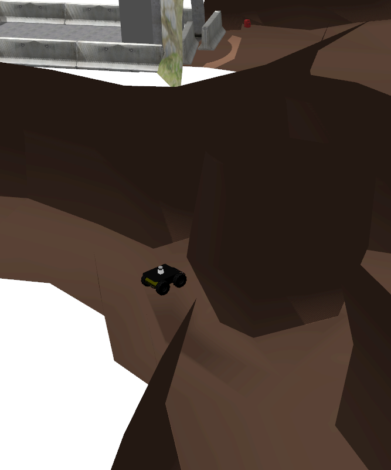
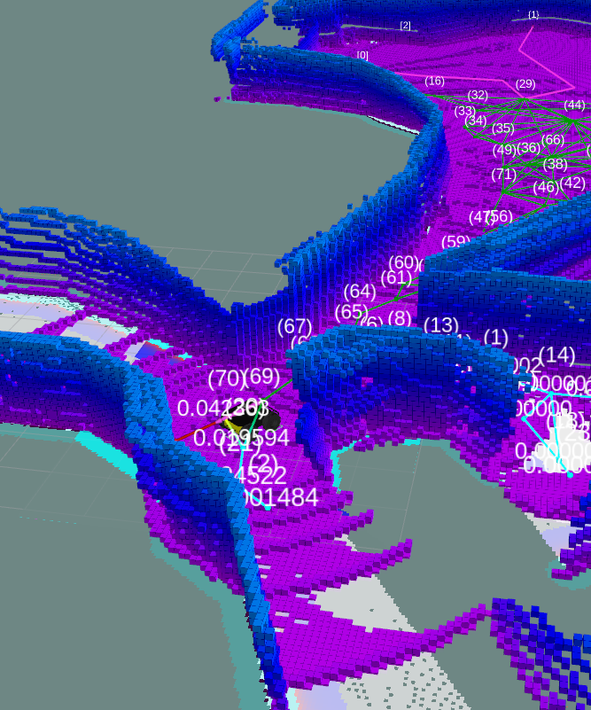

# Rapidly-Exploring Random Graph Next-Best View Exploration (RNE)

This package contains an exploration algorithm based on the Rapidly-Exploring Random Graph (RRG) to randomly sample the configuration space. 2D grid maps or 2.5D traversability grid maps can be supplied to the RNE to assess if a robot can reach new nodes in the tree. Sparse ray sampling in an OctoMap is used to evaluate the node's gain. Below two screenshots from gazebo and RViz are shown with RNE running in a simulation of an underground cave environment.

The RNE contains a plugin to use it as an exploration algorithm in the [Robot Statemachine (RSM) package](http://wiki.ros.org/robot_statemachine) and a global planner plugin for the [ROS navigation stack](http://wiki.ros.org/navigation).

Details about the RNE's implementation can be found in the [RRG NBV Exploration package](rrg_nbv_exploration#rrg-nbv-exploration) and about the plugins in the [RRG NBV Exploration Plugins package](rrg_nbv_exploration_plugins#rrg-nbv-exploration-plugins). The messages and services defined for the RNE are in the [RRG NBV Exploration Msgs package](rrg_nbv_exploration_msgs#rrg-nbv-exploration-messages). The plugins package also contains convenient config and launch files to run a simulation with RNE in gazebo.
