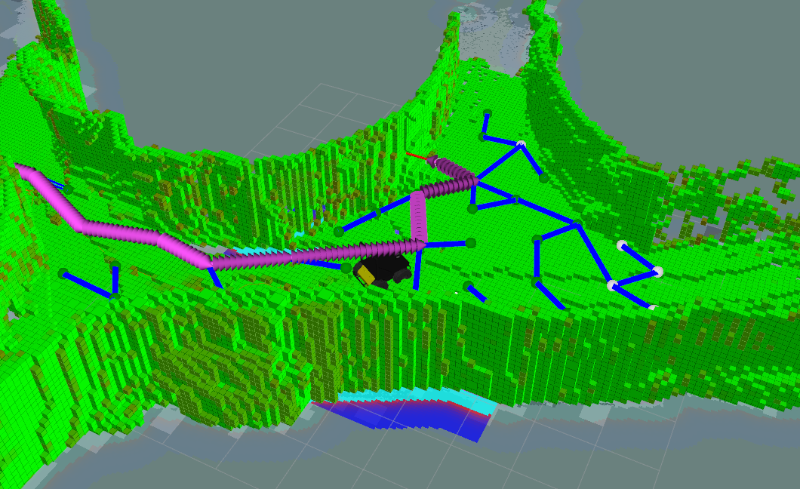

# Rapidly-Exploring Random Tree Next-Best View Exploration (RNE)

This package contains an exploration algorithm based on the Rapidly-Exploring Random Tree (RRT) to randomly sample the configuration space. 2D grid maps or 2.5D traversability grid maps can be supplied to the RNE to assess if a robot can reach new nodes in the tree. Sparse ray sampling in an OctoMap is used to evaluate the node's gain. Below a screenshot from RViz is shown with RNE running in a simulation of the underground mine "Reiche Zeche" in Freiberg, Germany.

The RNE contains a plugin to use it as an exploration algorithm in the [Robot Statemachine (RSM) package](http://wiki.ros.org/robot_statemachine) and a global planner plugin for the [ROS navigation stack](http://wiki.ros.org/navigation).

Details about the RNE's implementation can be found in the [RRT NBV Exploration package](rrt_nbv_exploration#rrt-nbv-exploration) and about the plugins in the [RRT NBV Exploration Plugins package](rrt_nbv_exploration_plugins#rrt-nbv-exploration-plugins). The messages and services defined for the RNE are in the [RRT NBV Exploration Msgs package](rrt_nbv_exploration_msgs#rrt-nbv-exploration-messages). The plugins package also contains convenient config and launch files to run a simulation with RNE in gazebo.
