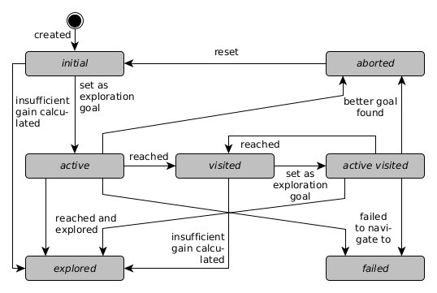
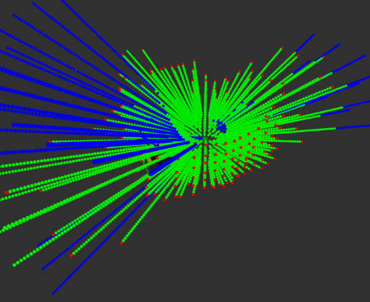

# RRG NBV Exploration

This package contains an exploration algorithm that aims at enabling 3D mapping for ground robots. First, an introduction to the package is shown. Then the [RNE's implementation](#documentation) will be explained, followed by a list of its [nodes](#nodes) with the particular parameters, published and subscribed topics.

## Introduction

The RNE is based on a Rapdily-exploring Random Graph (RRG) which was introduced by [Karaman and Frazzoli](http://roboticsproceedings.org/rss06/p34.pdf) and itself is based on [Rapidly-exploring Random Graphs (RRG)](https://en.wikipedia.org/wiki/Rapidly-exploring_random_graph) and [Probabilistic Roadmaps (PRM)](https://en.wikipedia.org/wiki/Probabilistic_roadmap). An RRG is constructed by creating new nodes at randomly sampled points. The new nodes have to be connected to the graph's nearest neighbors. Therefore, a method checks if the robot would be able to traverse between the new node and existing nodes in a specific radius around the new node. Additionally, nodes can be sampled locally around the robot's current position which aids at exploring large areas.

To efficiently explore the environment, the node providing the most information is chosen as the next exploration goal. This is evaluated by calculating its gain and cost and combining them in a reward function to compare all nodes. The gain is computed by a form of raycasting in an [OctoMap](http://wiki.ros.org/octomap) and the cost is based on the distance from the robot to the particular node measured only along the graph's edges, the traversability  as well as the change in heading along this path.

Each node in the graph stores its position in the map, its neighbors, its gain as well as the yaw direction for which the gain was computed, the path along the graph's edges to the robot and its state. The state can be one of the states shown in the State Diagram below.

The NBV is determined by choosing the node with the best reward function. The gain calculation uses Sparse Ray Polling (SRP) in which sample points are determined by the utilized sensor's FoV, range and the step size defined by the user. This should be set regarding the OctoMap's voxel's edge length and the computing power of the system running the RNE. This set of sample points is calculated at the RNE's initialization, so that during its execution the sample points can be placed at the particular node to be evaluated by adding the node's position to each sample point. This and the execution in a node separate from the RRG construction aims to speed up the exploration. Below a set of sample points is employed to evaluate a node. Blue denotes unknown space, green free space and red occupied space. The particular ray is not evaluated further when an obstacle was detected. Also, the best yaw orientation for the robot at this node is calculated by adding up all sampling slices that could be observed if the sensor is pointed at this particular direction. The direction with the highest combined gain is set as the best yaw. The horizontal FoV of the sensor is required for this.

The RNE can be run in *finish* and *interrupt* mode. In the former each exploration goal must be reached or reaching it must fail before the next goal is chosen. The latter mode allows a current goal to be aborted when a better goal was found. Since RRG construction and gain calculation are decoupled, a new goal is already selected while some node's gains are still being computed. Therefore, the *interrupt* mode allows for changing the goal when a node with a better gain becomes available.

The reward function *RF* for each node *n* is based on the particular node's gain *G*, path distance to the robot *D*, traversability of this path *T* and heading change along this path *H*. These values are all normalized to a value between 0 and 1 and are weighted with user-defined factors *g*, *d*, *t* and *h*. The result is also normalized to a value between 0 and 1 where a value of 1 is the best node to explore and 0 the worst.

*RF* = (*g* \* *G* + *d* \* *D* + *t* \* *T* + *h* \* *H*) / (*g* + *d* + *t* + *h*)

## Documentation

This package contains the RNE's core logic which is divided into the classes presented below.

### GraphConstructor

The class GraphConstructor includes the RRG algorithm which builds the graph in sample space defined by the given OctoMap's dimensions. It manages and publishes the graph's current state and maintains a list of all node's which gain must be recalculated, ordered by their distance to the robot. When a goal was explored, it triggers the update of all node's in two times the sensor's range. The nodes to be updated are published in a topic and the updated nodes are subscribed to. The GraphConstructor also includes services to start and stop the exploration. It publishes the current goal node and the node with the best gain.

### GraphSearcher

The GraphSearcher is an interface to [nanoflann](https://github.com/jlblancoc/nanoflann#nanoflann) which is header only library for building k-d-trees. All of the RRG's nodes are additionally stored in a k-d-tree to enable a fast nearest neighbor and radius search for constructing the graph and updating nodes in a radius.

### CollisionChecker

The CollisonChecker subscribes to an occupancy grid map topic and checks if a new node can be connected to the existing graph. Therefore, a circular area at the new node and a rectangular area between the new node and the nearest neighbor in the graph are checked for obstacles in the grid map. If they are obstacle free, the node can be added, if not it is discarded. During this check, the traversability is calculated as well.

### GraphPathCalculator

The GraphPathCalculator monitors the robot's position in the map, so that the node closest to the robot is always known. When the robot moves from one node to the next, the GraphPathCalculator updates the path from each particular node to the robot which is maintained in the node. This path can be retrieved for a global navigation planner. Furthermore, the heading changes and the traversability along this path are calculated or added up for each node for the reward function.

### NodeComparator

The NodeComparator stores a list of all nodes which can still be explored. This list is used to determine the node with the best reward function which is then proposed as the next goal to explore.

### GainCalculator

The GainCalculator calculates each node's gain by SRP. Therefore, sampling points are pre-calculated on initialization which are defined by parameters set by the user. The gain is the number of unknown sample points that can be observed from the node. It also sets the nodes' height by obtaining the ground's height from raytracing in the OctoMap. Nodes to be updated are subscribed to and updated nodes are published.

### RneVisualizer

The RneVisualizer subscribes to the published RRG and visualizes it for RViz, showing nodes as spheres colored according to the particular node's state (no gain: white, initial: light blue - lower reward - to dark blue - higher reward, active: yellow, visited: light green, active visited: orange, explored: dark green, failed: red) and edges as lines between the nodes. It also publishes text visualization that shows the nodes' number and reward function.

## Nodes

### RneNode

Controls the RRG construction and offers interfaces to it.

#### Published Topics

**rrg** ([rrg_nbv_exploration_msgs/Graph](../rrg_nbv_exploration_msgs/msg/Graph.msg))  
Current RRG graph with list of all nodes and edges

**node_to_update** ([rrg_nbv_exploration_msgs/NodeToUpdate](../rrg_nbv_exploration_msgs/msg/NodeToUpdate.msg))  
Node which gain should be calculated and a flag if it must be recalculated

**bestAndCurrentGoal** ([rrg_nbv_exploration_msgs/BestAndCurrentNode](../rrg_nbv_exploration_msgs/msg/BestAndCurrentNode.msg))  
Current exploration goal and node with best reward function

**rrg_collision_map** ([nav_msgs/OccupancyGrid](http://docs.ros.org/en/melodic/api/nav_msgs/html/msg/OccupancyGrid.html))  
Obstacle free areas around nodes and edges checked by the RRG

**rrg_collision_vis** ([visualization_msgs/MarkerArray](http://docs.ros.org/en/melodic/api/visualization_msgs/html/msg/MarkerArray.html))  
Visualization of the rectangles and circles which must be checked for traversability

#### Subscribed Topics

**<octomap_topic>** ([octomap_msgs/Octomap](http://docs.ros.org/en/melodic/api/octomap_msgs/html/msg/Octomap.html))  
OctoMap voxel grid for sampling space dimensions

**updated_node** ([rrg_nbv_exploration_msgs/Node](../rrg_nbv_exploration_msgs/msg/Node.msg))  
Node which gain was recently calculated

**<occupancy_grid_topic>** ([nav_msgs/OccupancyGrid](http://docs.ros.org/en/melodic/api/nav_msgs/html/msg/OccupancyGrid.html))  
Grid map to check for traversability

#### Services

**requestGoal** ([rrg_nbv_exploration_msgs/RequestGoal](../rrg_nbv_exploration_msgs/srv/RequestGoal.srv))  
Returns the current goal's position and orientation if available

**requestPath** ([rrg_nbv_exploration_msgs/RequestPath](../rrg_nbv_exploration_msgs/srv/RequestPath.srv))  
Returns the path from the robot to the current goal

**updateCurrentGoal** ([rrg_nbv_exploration_msgs/UpdateCurrentGoal](../rrg_nbv_exploration_msgs/srv/UpdateCurrentGoal.srv))  
Sends the status of the current goal

**setRrgState** ([std_srvs/SetBool](http://docs.ros.org/api/std_srvs/html/srv/SetBool.html))  
Start or stop exploration (true to start, false to stop)

**getRrgState** ([std_srvs/Trigger](http://docs.ros.org/en/melodic/api/std_srvs/html/srv/Trigger.html))  
Returns if the exploration is currently running

**resetRrgState** ([std_srvs/Trigger](http://docs.ros.org/en/melodic/api/std_srvs/html/srv/Trigger.html))  
Stops the exploration and resets the graph

#### Parameters

**~update_frequency** (float, default: 20)  
Update rate in Hz

**~sensor_max_range** (float, default: 5.0)  
Max sensor range

**~sensor_height** (float, default: 0.5)  
Height of the sensor measured from the robot's base frame (obtain with `rosrun tf_echo robot_frame sensor_frame` if unsure)

**~robot_radius** (float, default: 1.0)  
Circumference of the robot which must be obstacle free so that it can turn on the spot (add margin if required)

**~robot_width** (float, default: 1.0)  
Width of the robot (add margin if required)

**~exploration_finished_timer_duration** (float, default: 1.0)  
Time to wait after the last node was added to the RRG and no node is currently the goal before stopping the exploration

**~octomap_topic** (string, default: "octomap_binary")  
Topic name of the OctoMap required for gain calculation

**~occupancy_grid_topic** (string, default: "map")  
Topic name of the occupancy grid required sampling space dimensions

**~robot_frame** (string, default: "base_footprint")  
Frame name of the robot's base frame

**~check_init_position** (bool, default: false)  
If the position at which the robot currently is when starting RNE should be checked for collision

**~grid_map_resolution** (double, default: 0.05)  
Resolution of the grid map for collision checking

**~grid_map_occupied** (int, default: 100)  
Value from which and above a grid map tile counts as occupied

**~grid_map_unknown** (int, default: -1)  
Value at which a grid map tile counts as unknown

**~local_sampling_radius** (double, default: 5.0)  
Samples additional nodes in the given radius around the robot if radius is greater than zero

**~min_edge_distance** (double, default: 1.0)  
Min distance between two nodes in the graph

**~max_edge_distance** (double, default: 2.0)  
Max distance between two nodes in the graph

**~nearest_node_tolerance** (double, default: 0.1)  
Distance to a node in m to count it as nearest node

**~max_consecutive_failed_goals** (int, default: 5)  
Maximum number of consecutive failed goals before exploration is cancelled because the robot is assumed stuck

**~gain_factor** (double, default: 1.0)  
Weighting factor for the information gain of a node

**~_distance_factor** (double, default: 1.0)  
Weighting factor for the distance to a node

**~_traversability_factor** (double, default: 1.0)  
Weighting factor for the traversability cost along the path to a node

**~_heading_factor** (double, default: 1.0)  
Weighting factor for the heading change while moving to a node

#### Required tf Transforms

**map -> <robot_frame>**  
Usually provided by SLAM

### GainCalcNode

Calculates the gain of given nodes by SRP in the OctoMap and the height of the node by raytracing to find the ground. It places the node at sensor height above the ground.

#### Published Topics

**raysample_visualization** ([visualization_msgs/Marker](http://docs.ros.org/en/melodic/api/visualization_msgs/html/msg/Marker.html))  
Visualization of the previous SRP

**updated_node** ([rrg_nbv_exploration_msgs/Node](../rrg_nbv_exploration_msgs/msg/Node.msg))  
Node which gain was recently calculated

#### Subscribed Topics

**<octomap_topic>** ([octomap_msgs/Octomap](http://docs.ros.org/en/melodic/api/octomap_msgs/html/msg/Octomap.html))  
OctoMap voxel grid for gain calculation

**node_to_update** ([rrg_nbv_exploration_msgs/NodeToUpdate](../rrg_nbv_exploration_msgs/msg/NodeToUpdate.msg))  
Node which gain should be calculated and a flag if it must be recalculated

#### Parameters

**~sensor_max_range** (float, default: 5.0)  
Max sensor range

**~sensor_min_range** (float, default: 1.0)  
Min sensor range

**~sensor_height** (float, default: 0.5)  
Height of the sensor measured from the robot's base frame (obtain with `rosrun tf_echo robot_frame sensor_frame` if unsure)

**~sensor_size** (float, default: 0.1)  
Radius in m of a sphere that best describes the sensor's volume (checking for obstacles begins outside of this radius)

**~delta_phi** (int, default: 10)  
Step size in Phi-direction in degrees (corresponds to vertical FoV)

**~delta_theta** (int, default: 10)  
Step size in Theta-direction in degrees (corresponds to circle's circumference)

**~delta_radius** (float, default: 0.1)  
Step size in radius-direction in m

**~sensor_horizontal_fov** (int, default: 360)  
Horizontal field of view for the sensor in degrees

**~sensor_vertical_fov_bottom** (int, default: 0)  
Sensor's vertical FoV bottom edge that is considered for gain calculation (in degrees, from 180 to 0 as the highest angle)

**~sensor_vertical_fov_top** (int, default: 180)  
Sensor's vertical FoV top edge that is considered for gain calculation (in degrees, from 180 to 0 as the highest angle)

**~min_view_score** (float, default: 0.1)  
Min percentage of max possible gain for a node to be considered as a goal, if the node's gain is below this threshold, it is set to the *explored* state (see [here](../rrg_nbv_exploration_plugins#starting-rne) for additional details)

**~octomap_topic** (string, default: "octomap_binary")  
Topic name of the OctoMap required for gain calculation

**~oc_resolution** (float, default: 0.1)  
Resolution of octomap (edge length of voxels in m)

**~max_node_height_difference** (float, default: 1.0)  
Max plausible/acceptable height difference between the node's initial height and the measured height by raytracing

### RneVisualizationNode

Visualizes the RRG for RViz by publishing it as markers (nodes as sphere and edges as lines). The nodes are colored corresponding to their particular state (see RneVisualize).

#### Published Topics

**rrg_vis** ([visualization_msgs/Marker](http://docs.ros.org/en/melodic/api/visualization_msgs/html/msg/Marker.html))  
Visualization of the RRG with nodes as spheres and edges as lines

**rrg_vis_info** ([visualization_msgs/MarkerArray](http://docs.ros.org/en/melodic/api/visualization_msgs/html/msg/MarkerArray.html))  
Visualization of the RRG's node's numbers plus gain as text (published only every 2s)

#### Subscribed Topics

**rrg** ([rrg_nbv_exploration_msgs/Graph](../rrg_nbv_exploration_msgs/msg/Graph.msg))  
Current RRG graph with list of all nodes
