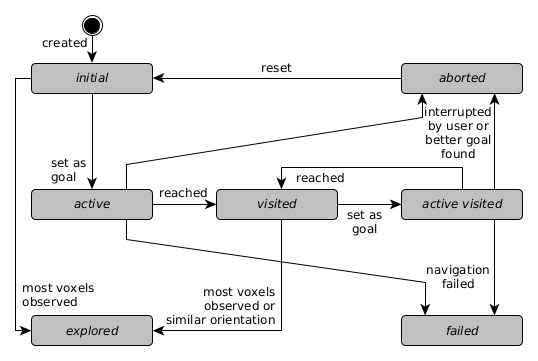
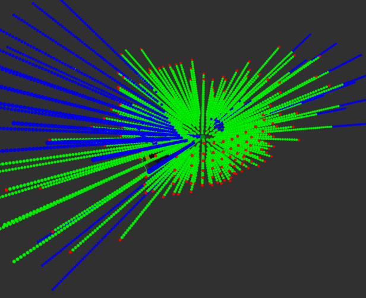
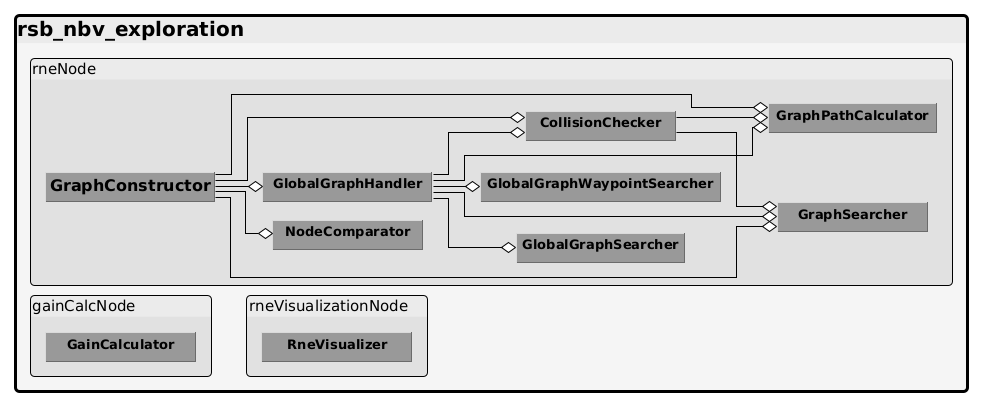

# RSB NBV Exploration

This package contains an exploration algorithm which enables 3D mapping for ground robots. First, an introduction to the package is shown. Then [RNE's implementation](#documentation) will be explained, followed by a list of its [nodes](#nodes) with the particular parameters, published and subscribed topics.

## Introduction

RNE is based on a Rapidly-exploring Random Graph (RRG) which was introduced by [Karaman and Frazzoli](https://arxiv.org/abs/1005.0416) and itself is based on [Rapidly-exploring Random Trees (RRT)](https://en.wikipedia.org/wiki/Rapidly-exploring_random_tree) and [Probabilistic Roadmaps (PRM)](https://en.wikipedia.org/wiki/Probabilistic_roadmap). An RRG is constructed by creating new nodes at randomly sampled points. The new nodes have to be connected to the graph's nearest neighbors. Therefore, a method checks if the robot would be able to traverse between the new node and existing nodes in a specific radius around the new node. Additionally, nodes can be sampled locally around the robot's current position which aids at exploring large areas.

To efficiently explore the environment, the node providing the most information is chosen as the next exploration goal. This is evaluated by calculating its gain and cost and combining them in a reward function to compare all nodes. The gain is computed using a form of raycasting in an [OctoMap](http://wiki.ros.org/octomap) and the cost is based on the distance from the robot to the particular node measured along the graph's edges, the traversability, the change in heading and the nodes' radii along this path. The best path is selected based on this combined cost using [Dijkstra's algorithm](https://en.wikipedia.org/wiki/Dijkstra%27s_algorithm) for finding shortest paths in a weighted graph.

Each node in the graph stores its position in the map, its neighbors, its gain as well as the yaw direction for which the gain was computed, the path along the graph's edges to the robot and its state. The state can be one of the seven states shown in the State Diagram below.

The NBV is determined by choosing the node with the best reward function. The gain calculation uses Sparse Ray Polling (SRP) in which sample points are determined by the utilized sensor's FoV, range and the step size defined by the user. This should be set regarding the OctoMap's voxel's edge length and the computing power of the system running the RNE. This set of sample points is calculated at the RNE's initialization, so that during its execution, the sample points can be placed at the particular node to be evaluated by adding the node's position to each sample point. This and the execution in a node separate from the RRG construction aims to speed up the exploration. Below a set of sample points is employed to evaluate a node. Blue denotes unknown space, green free space and red occupied space. The particular ray is not evaluated further when an obstacle was detected. Also, the best yaw orientation for the robot at this node is calculated by adding up all sampling slices that could be observed if the sensor is pointed at this particular direction. The direction with the highest combined gain is set as the best yaw. The horizontal FoV of the sensor is required for this.

The RNE can be run in *finish* or *interrupt* mode. In the former each exploration goal must be reached or reaching it must fail before the next goal is chosen. The latter mode allows a current goal to be aborted when a better goal was found. Since the graph construction and gain calculation are decoupled, a new goal is already selected while some node's gains are still being computed. Therefore, the *interrupt* mode allows for changing the goal when a node with a better gain becomes available.

If activated, the Node Area Inflation (NAI) allows to increase the radius of each node above the robot radius up to the maximum sensor range. In this mode, nodes are connected if they have an intersection large enough to fit the robot's width. Furthermore, when nodes are being placed and inflated, they will be moved away from obstacles and existing nodes to allow for larger radii. If NAI halts due to a collision with unknown space, it can continue at a later iteration. Larger radii are associated with a safer traversal of the particular node and a more observable space because of a larger distance to obstacles. If an inflated node completely encircles another node's area, the encircled node is removed.

The reward function $R$ for each node $n$ is based on the particular node's gain $G$, path distance to the robot $D$, traversability of this path $T$, heading change along this path $H$ and radii of the nodes along this path $I$. These values are weighted with user-defined factors $d$, $t$, $h$ and $r$. The latter are bundled in the cost function $C$.

$$R(n) = G(n)\cdot C(n)$$  

$$C(n) = e^-\frac{d \cdot D(n) + h \cdot H(n) + t \cdot T(n)}{1 + r \cdot I(n)}$$  

$$C_b(n) = e^-(d \cdot D(n) + h \cdot H(n) + t \cdot T(n))$$

The gain $G$ is the number of unknown voxels identified by SRP at the node's position divided by the maximum number of voxels that are evaluated by SRP. Distance $D$ is the distance along the edges from the robot to a particular node in meters. The heading change $H$ is the added up change in heading along the edges from the robot to a particular node in degrees divided by 180. This means, 1m of distance has the same impact on the cost function as completely turning the robot around. Traversability $T$ is calculated using the cost of each tile inside every node's radius and edge box along the path from the robot to a particular node divided by the value at which a tile counts as an obstacle. This cost is divided by the amount of tiles to have a normalized cost per tile. The radius $I$ is the average radius of all nodes along the path from the robot to a particular node divided by the robot radius.

These factors and their visualization can be adjusted using Dynamic Reconfigure (start it with `rosrun rqt_reconfigure rqt_reconfigure`);

A distinction between local and global exploration to reduce the computation overhead of maintaining a constantly growing graph is introduced. The previously described algorithm becomes the local part of this hybrid RNE implementation. Its graph is limited to a local area around the robot while a global exploration graph keeps track of unexplored nodes from the local exploration. These nodes must be visited to complete the global exploration. A shortest route has to be found which goes through every node exactly once to efficiently visit all of them. This is implemented with a Traveling Salesman Problem (TSP) solver.

Local unexplored nodes that fall outside of the local exploration area are added as global targets to the global graph. The edges from the local graph are used to create global connections between the targets and the local graph which are maintained and updated while the local exploration area moves with the robot. Global targets that are close to each other are merged using a heuristic that regards their Euclidean distance to each other, the distance along the edges connecting them and the distance to global targets that might have already been merged into them. The goal is to cluster all targets that are inside the local exploration area of the remaining target, so that no unexplored node is lost.

When no explorable nodes are left in the local exploration area, the global exploration is started, the local graph is discarded and sampling is stopped. Therefore, all missing target to target connections are established through the local graph and a 2-opt TSP solver is deployed to order the targets for exploration. The first global target is selected and the robot will navigate towards it along the global connection starting from the local graph. Upon reaching the global target, the local exploration is re-initialized at its position. When no explorable nodes are inside its area, this process is repeated until no global targets are left. Then, the exploration is finished.

Optionally, the origin of the exploration can be added as a global target which always has to be the last target to navigate to. After exploring all other targets, the robot will return to it which implements a homing behavior.

## Documentation

This package contains the RNE's core logic which is divided into the classes presented below and shown in the class diagram.

### GraphConstructor

The class GraphConstructor includes the sampling algorithm which builds the graph in sample space defined by the given OctoMap's dimensions. It manages and publishes the local graph's current state and maintains a list of all node's whose gain must be recalculated, ordered by their distance to the robot. When a goal was explored, it triggers the update of all node's in two times the sensor's range. These updates can also be executed while the robot traverses the graph to enable more accurate goal selection. The nodes to be updated are published in a topic and the updated nodes are subscribed to. The GraphConstructor also includes services to start and stop the exploration. It publishes the current goal node and the node with the best gain.

### GraphSearcher

The GraphSearcher is an interface to [nanoflann](https://github.com/jlblancoc/nanoflann#nanoflann) which is a header only library for building k-d trees. All of the RRG's nodes are additionally stored in a k-d tree to enable a fast nearest neighbor and radius search for constructing the graph and updating nodes in a radius.

### CollisionChecker

The CollisonChecker subscribes to an occupancy grid map topic and checks if a new node can be connected to the existing graph. Therefore, a circular area at the new node and a rectangular area between the new node and the nearest neighbor in the graph are checked for obstacles in the grid map. If they are obstacle free, the node can be added, if not it is discarded. During this check, the traversability is calculated as well. If NAI is active, the nodes' circular areas are connected directly. For inflating a node area, the traversability is checked in increasing rings around the node's current radius. Also, moving the node away from obstacles and existing nodes is done using these rings at shifted positions. Recovery of previously failed nodes is also possible by checking the circular area again to verify if it contains obstacles.

### GraphPathCalculator

The GraphPathCalculator monitors the robot's position in the map, so that the node closest to the robot is always known. When the robot moves from one node to the next, the GraphPathCalculator updates the path from each particular node to the robot which is maintained in the node. This path can be retrieved for a global navigation planner. Furthermore, the distance, heading changes, traversability and node radii along this path are calculated and added up for each node for the cost function. The path is based on Dijkstra's algorithm using the cost function for each node.

### NodeComparator

The NodeComparator stores a list of all nodes which can still be explored. This list is used to determine the node with the best reward function which is then proposed as the next goal to explore.

### GainCalculator

The GainCalculator calculates each node's gain by SRP. Therefore, sampling points are pre-calculated on initialization which are defined by parameters set by the user. The gain is the number of unknown sample points that can be observed from the node. It also sets the nodes' height by obtaining the ground's height from raytracing in the OctoMap. Nodes to be updated are subscribed to and updated nodes are published.

### GlobalGraphHandler

The GlobalGraphHandler is responsible for adding and merging global targets as well as their respective global connections. It includes the 2-opt TSP solver to determine the next global goal and the global path towards it. 

### GlobalGraphSearcher

This class also employs the [nanoflann](https://github.com/jlblancoc/nanoflann#nanoflann) header-only library to store and access the global targets in a k-d tree for nearest neighbor and radius searches.

### GlobalGraphWaypointSearcher

The GlobalGraphWaypointSearcher uses the [nanoflann](https://github.com/jlblancoc/nanoflann#nanoflann) header-only library on global connection waypoints for pruning the connections and determining the closest waypoint to the robot.

### RneVisualizer

The RneVisualizer subscribes to the published RRG and visualizes it for RViz, showing nodes as spheres colored according to the particular node's state (no gain: white, initial: light blue - lower reward - to dark blue - higher reward, active: yellow, visited: light green, active visited: orange, explored: dark green, failed: red) and edges as lines between the nodes. It also publishes text visualization that shows the nodes' number and reward function. If activated, all parts of the reward and cost function can be shown as well.

Furthermore, the global targets are depicted as cubes with a unique, random color. Their index is visualized above them with curly brackets around if the target has other targets merged into it. Global connections are shown as lines and share the color of the target with the highest index that they are connected to.

## Nodes

### RneNode

Controls the RNE construction and offers interfaces to it.

#### Published Topics

**rrg** ([rsb_nbv_exploration_msgs/Graph](../rsb_nbv_exploration_msgs/msg/Graph.msg))  
Local graph with lists of all nodes and edges

**globalgraph** ([rsb_nbv_exploration_msgs/GlobalGraph](../rsb_nbv_exploration_msgs/msg/GlobalGraph.msg))  
Global graph with lists of all global targets and connections

**node_to_update** ([rsb_nbv_exploration_msgs/NodeToUpdate](../rsb_nbv_exploration_msgs/msg/NodeToUpdate.msg))  
Node whose gain should be calculated and a flag if it must be recalculated

**bestAndCurrentGoal** ([rsb_nbv_exploration_msgs/BestAndCurrentNode](../rsb_nbv_exploration_msgs/msg/BestAndCurrentNode.msg))  
Current exploration goal and node with best reward function

**explorationGoalObsolete** ([rsb_nbv_exploration_msgs/ExplorationGoalObsolete](../rsb_nbv_exploration_msgs/msg/ExplorationGoalObsolete.msg)) 
If the current goal is still the best goal and if it was already requested by navigation

**rrg_collision_map** ([nav_msgs/OccupancyGrid](http://docs.ros.org/en/melodic/api/nav_msgs/html/msg/OccupancyGrid.html))  
Obstacle free areas around nodes and edges checked by the RRG

**rrg_collision_vis** ([visualization_msgs/MarkerArray](http://docs.ros.org/en/melodic/api/visualization_msgs/html/msg/MarkerArray.html))  
Visualization of the rectangles and circles which must be checked for traversability

**rne_runtime**  ([std_msgs/Duration](http://docs.ros.org/en/melodic/api/std_msgs/html/msg/Duration.html))
The time that RNE has been running since start

#### Subscribed Topics

**<octomap_topic>** ([octomap_msgs/Octomap](http://docs.ros.org/en/melodic/api/octomap_msgs/html/msg/Octomap.html))  
OctoMap voxel grid for sampling space dimensions

**updated_node** ([rsb_nbv_exploration_msgs/Node](../rsb_nbv_exploration_msgs/msg/Node.msg))  
Node which gain was recently calculated

**<occupancy_grid_topic>** ([nav_msgs/OccupancyGrid](http://docs.ros.org/en/melodic/api/nav_msgs/html/msg/OccupancyGrid.html))  
Grid map to check for traversability

#### Services

**requestGoal** ([rsb_nbv_exploration_msgs/RequestGoal](../rsb_nbv_exploration_msgs/srv/RequestGoal.srv))  
Returns the current goal's position and orientation if available

**requestPath** ([rsb_nbv_exploration_msgs/RequestPath](../rsb_nbv_exploration_msgs/srv/RequestPath.srv))  
Returns the path from the robot to the current goal

**updateCurrentGoal** ([rsb_nbv_exploration_msgs/UpdateCurrentGoal](../rsb_nbv_exploration_msgs/srv/UpdateCurrentGoal.srv))  
Sends the status of the current goal

**setRneState** ([std_srvs/SetBool](http://docs.ros.org/api/std_srvs/html/srv/SetBool.html))  
Start or stop exploration (true to start, false to stop)

**getRneState** ([std_srvs/Trigger](http://docs.ros.org/en/melodic/api/std_srvs/html/srv/Trigger.html))  
Returns if the exploration is currently running

**resetRneState** ([std_srvs/Trigger](http://docs.ros.org/en/melodic/api/std_srvs/html/srv/Trigger.html))  
Stops the exploration and resets the graph

#### Parameters

**~update_frequency** (float, default: 20)  
Update rate in Hz

**~samples_per_loop** (int, default: 10)
The number of attempted samples each loop

**~sensor_max_range** (float, default: 5.0)  
Max sensor range

**~sensor_height** (float, default: 0.5)  
Height of the sensor measured from the robot's base frame (obtain with `rosrun tf_echo robot_frame sensor_frame` if unsure)

**~sensor_horizontal_fov** (int, default: 360)  
Horizontal field of view for the sensor in degrees

**~robot_radius** (float, default: 1.0)  
Circumference of the robot which must be obstacle free so that it can turn on the spot (add margin if required)

**~robot_width** (float, default: 1.0)  
Width of the robot (add margin if required)

**~exploration_finished_timer_duration** (float, default: 1.0)  
Time to wait after the last node was added to the RRG and no node is currently the goal before stopping the exploration

**~octomap_topic** (string, default: "octomap_binary")  
Topic name of the OctoMap required for gain calculation

**~occupancy_grid_topic** (string, default: "map")  
Topic name of the occupancy grid required sampling space dimensions

**~robot_frame** (string, default: "base_footprint")  
Frame name of the robot's base frame

**~check_init_position** (bool, default: false)  
If the position at which the robot currently is when starting RNE should be checked for collision

**~grid_map_resolution** (double, default: 0.05)  
Resolution of the grid map for collision checking

**~grid_map_occupied** (int, default: 100)  
Value from which and above a grid map tile counts as occupied

**~grid_map_unknown** (int, default: -1)  
Value at which a grid map tile counts as unknown

**~local_sampling_radius** (double, default: 5.0)  
Samples additional nodes in the given radius around the robot if radius is greater than zero

**~min_edge_distance** (double, default: 1.0)  
Min distance between two nodes in the graph

**~max_edge_distance** (double, default: 2.0)  
Max distance between two nodes in the graph

**~nearest_node_tolerance** (double, default: 0.1)  
Distance to a node in m to count it as nearest node

**~max_consecutive_failed_goals** (int, default: 5)  
Maximum number of consecutive failed goals before exploration is cancelled because the robot is assumed to be stuck

**~gain_factor** (double, default: 1.0)  
Weighting factor for the information gain of a node

**~_distance_factor** (double, default: 1.0)  
Weighting factor for the distance to a node

**~_traversability_factor** (double, default: 1.0)  
Weighting factor for the traversability cost along the path to a node

**~_heading_factor** (double, default: 1.0)  
Weighting factor for the heading change while moving to a node

**~_radius_factor** (double, default: 1.0)  
Weighting factor for the node radii along the path to a node

**~inflation_active** (bool, default: true)  
If the inflation of nodes past the robot radius up to the maximum sensor range is allowed

**~move_nodes** (bool, default: true)  
If nodes can be moved away from obstacles and nearby nodes during inflation to try to achieve a larger radius

**~reupdate_nodes** (bool, default: true)  
If initial nodes' gain should be recalculated when the robot's nearest neighbors changes and the GainCalculator is currently idle

**~initialization_node_distance** (float, default: 0.0)
The distance of an initialization node added without a traversability check at the given distance in front of the robot when starting the exploration, no node is added if it equals 0

**global_exploration_active** (bool, default: true)
If global and local exploration are active or only local exploration

**~auto_homing** (bool, default: false)  
Return to the root node if all nodes were either explored or failed (exploration is finished)

**~measure_algorithm_runtime** (bool, default: false)
Measure the total time the algorithm is running since the current exploration started

#### Required tf Transforms

**map -> <robot_frame>**  
Usually provided by SLAM

### GainCalcNode

Calculates the gain of given nodes by SRP in the OctoMap and the height of the node by ray tracing to find the ground. It places the node at sensor height above the ground.

#### Published Topics

**raysample_visualization** ([visualization_msgs/Marker](http://docs.ros.org/en/melodic/api/visualization_msgs/html/msg/Marker.html))  
Visualization of the previous SRP

**updated_node** ([rsb_nbv_exploration_msgs/Node](../rsb_nbv_exploration_msgs/msg/Node.msg))  
Node which gain was recently calculated

**gaincalc_runtime**  ([std_msgs/Duration](http://docs.ros.org/en/melodic/api/std_msgs/html/msg/Duration.html))
The time that RNE gain calculation has been running since start

#### Subscribed Topics

**<octomap_topic>** ([octomap_msgs/Octomap](http://docs.ros.org/en/melodic/api/octomap_msgs/html/msg/Octomap.html))  
OctoMap voxel grid for gain calculation

**node_to_update** ([rsb_nbv_exploration_msgs/NodeToUpdate](../rsb_nbv_exploration_msgs/msg/NodeToUpdate.msg))  
Node which gain should be calculated and a flag if it must be recalculated

#### Parameters

**~sensor_max_range** (float, default: 5.0)  
Max sensor range

**~sensor_min_range** (float, default: 1.0)  
Min sensor range

**~sensor_height** (float, default: 0.5)  
Height of the sensor measured from the robot's base frame (obtain with `rosrun tf_echo robot_frame sensor_frame` if unsure)

**~sensor_size** (float, default: 0.1)  
Radius in m of a sphere that best describes the sensor's volume (checking for obstacles begins outside of this radius)

**~delta_phi** (int, default: 10)  
Step size in Phi-direction in degrees (corresponds to vertical FoV)

**~delta_theta** (int, default: 10)  
Step size in Theta-direction in degrees (corresponds to circle's circumference)

**~delta_radius** (float, default: 0.1)  
Step size in radius-direction in m

**~sensor_horizontal_fov** (int, default: 360)  
Horizontal field of view for the sensor in degrees

**~sensor_vertical_fov_bottom** (int, default: 0)  
Sensor's vertical FoV bottom edge that is considered for gain calculation (in degrees, from 180 to 0 as the highest angle)

**~sensor_vertical_fov_top** (int, default: 180)  
Sensor's vertical FoV top edge that is considered for gain calculation (in degrees, from 180 to 0 as the highest angle)

**~min_view_score** (float, default: 0.1)  
Min percentage of max possible gain for a node to be considered as a goal, if the node's gain is below this threshold, it is set to the *explored* state (see [here](../rrg_nbv_exploration_plugins#starting-rne) for additional details)

**~octomap_topic** (string, default: "octomap_binary")  
Topic name of the OctoMap required for gain calculation

**~oc_resolution** (float, default: 0.1)  
Resolution of octomap (edge length of voxels in m)

**~max_node_height_difference** (float, default: 1.0)  
Max plausible/acceptable height difference between the node's initial height and the measured height by raytracing

**measure_algorithm_runtime** (bool, default: false)
Measure the total time the algorithm is running since the current exploration started

### RneVisualizationNode

Visualizes the local and global graphs for RViz by publishing it as markers.

#### Published Topics

**rrg_vis** ([visualization_msgs/Marker](http://docs.ros.org/en/melodic/api/visualization_msgs/html/msg/Marker.html))  
Visualization of the local graph with nodes as spheres and edges as lines

**rrg_vis_info** ([visualization_msgs/MarkerArray](http://docs.ros.org/en/melodic/api/visualization_msgs/html/msg/MarkerArray.html))  
Visualization of the local graph nodes' numbers plus gain as text (published only every second)

**globalgraph_vis** ([visualization_msgs/Marker](http://docs.ros.org/en/melodic/api/visualization_msgs/html/msg/Marker.html))  
Visualization of the global graph with targets as cubes and connections as lines

**globalgraph_vis_info** ([visualization_msgs/MarkerArray](http://docs.ros.org/en/melodic/api/visualization_msgs/html/msg/MarkerArray.html))  
Visualization of the global graph target's numbers, in curly brackets if the target has been clustered (published only every second)

#### Subscribed Topics

**rrg** ([rsb_nbv_exploration_msgs/Graph](../rsb_nbv_exploration_msgs/msg/Graph.msg))  
Current RRG graph with list of all nodes

**globalgraph** ([rsb_nbv_exploration_msgs/GlobalGraph](../rsb_nbv_exploration_msgs/msg/GlobalGraph.msg))  
Global graph with lists of all global targets and connections

####Parameters

**~robot_radius** (float, default: 1.0)  
Circumference of the robot which must be obstacle free so that it can turn on the spot (add margin if required)

**~grid_map_occupied** (int, default: 100)  
Value from which and above a grid map tile counts as occupied

**~show_gain_info** (bool, default: false)  
If the gain of each node should be displayed as info text

**~show_distance_info** (bool, default: false)  
If the distance of each node should be displayed as info text

**~show_traversability_info** (bool, default: false)  
If the traversability of each node should be displayed as info text

**~show_heading_info** (bool, default: false)  
If the heading change of each node should be displayed as info text

**~show_radius_info** (bool, default: false)  
If the radius of each node should be displayed as info text

**~show_cost_info** (bool, default: false)  
If the cost function of each node should be displayed as info text
